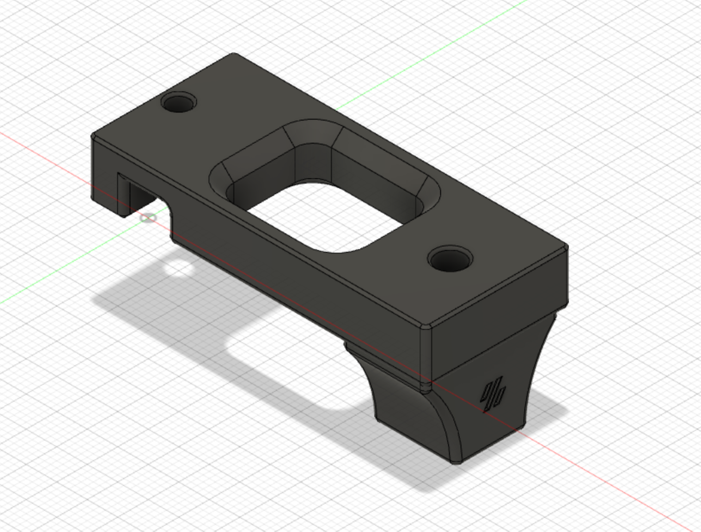
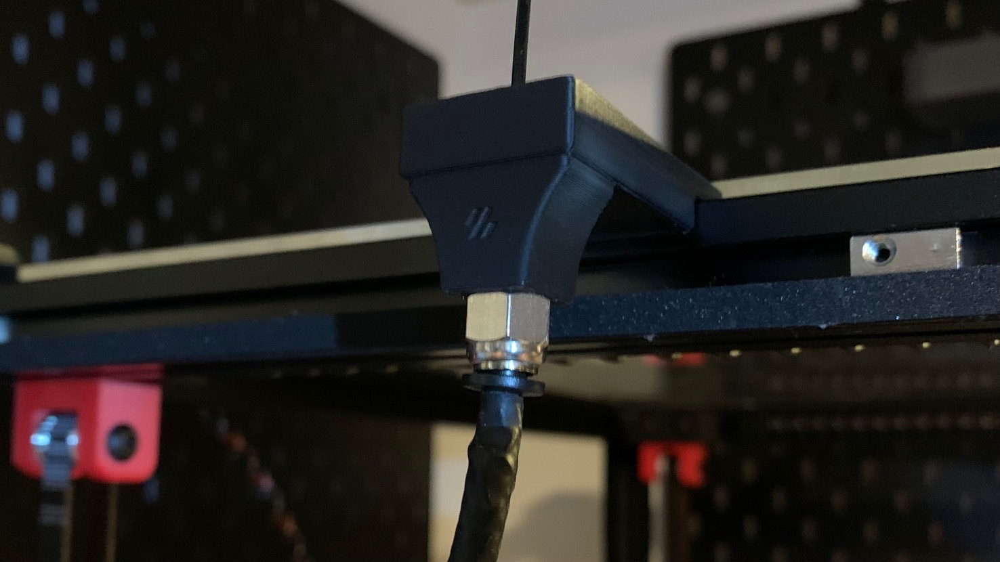

# Vertical bowden mount
## Credit
Mod based on the design of the Voron crew.
Thank you for your awesome work!
## Print settings
As stated in the Voron documentation:
* ABS
* 0.2mm layer hight
* 0.4mm extrusion width
* 40% infill
* wall count 4
* top/bottom layers 5
* no supports

## Bom
* printed part
* pneumatic coupler pc4-m10

## Improvement
* Opening of the reverse bowden is facing upwards.

## Description
If you have your spools above the printer this mod changes the direction of the reverse bowden tube to face upwards, not sideways. The pneumatic coupler holds the bowden tube in place and allows for easy removal. It can be screwed right into the plastic part.

## Pictures

&nbsp; 

